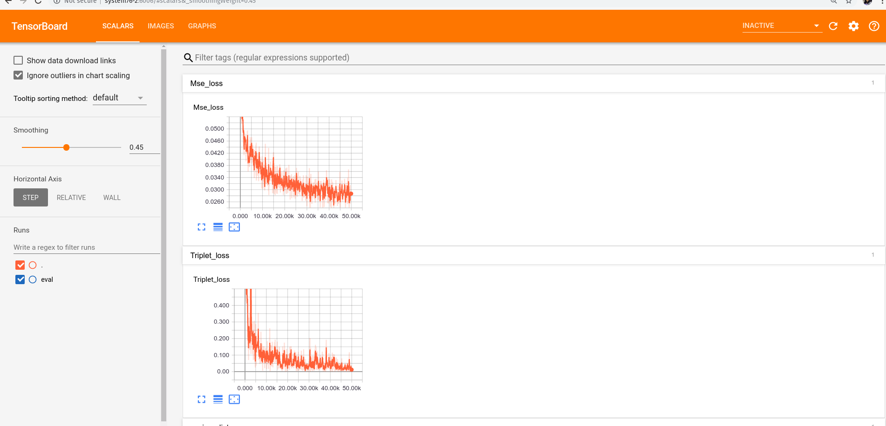

This subfolder consists MNIST recnstruction analysis project . 
In this project, Fahion MNIST dataset is used for analysis . The idea is to build a convolutional autoencoder network for MNIST data 
reconstruction. Autoencoders can be used for a multitude of tasks such as : 
1) Reconstruction
2) Anomaly detection 
3) Denoising images 

In this particular analysis the aim was to implement tsne clustering on compressed feature representations from the autoencoder network while also looking at the reconstruction quality . 
The jupyter notebook consists of the code and explaination of the approach and results obtained.

The images below are tensorboard results which show the loss curves during the training . 
MSE and triplet loss was used for the purpose of reconstruction and inter class resemblance and clustering respectively.

